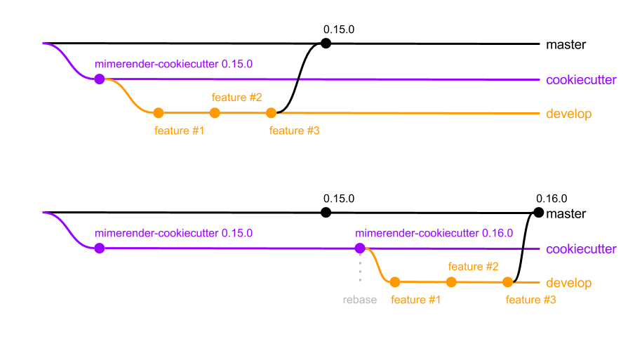

# mimerender-cookiecutter

A [cookiecutter](https://github.com/audreyr/cookiecutter) template for creating
a JupyterLab and Jupyter Notebook extension for rendering specific mime types and file extensions.

## Examples

* [jupyterlab_json](https://github.com/jupyterlab/jupyter-renderers)
* [jupyterlab_geojson](https://github.com/jupyterlab/jupyter-renderers)
* [jupyterlab_plotly](https://github.com/jupyterlab/jupyter-renderers)

## Usage

Install cookiecutter:

```
pip install cookiecutter
```

Use cookiecutter to generate a package:

```
cookiecutter https://github.com/jupyterlab/mimerender-cookiecutter
```

## Prompts

The cookiecutter will prompt you with the following questions and generate a project according to your responses:
  
* `author_name`: Your full name. This will be used in the generated Python and npm packages.
* `author_email`: Your email address. This will be used in the generated Python and npm packages.
* `mime_type`: A valid mime type (e.g. `application/json`, `application/geo+json`). This will be used to render output data of this mime type with your extension.
* `mime_short_name`: A display name (no spaces) for your mime type (e.g. `JSON`, `GeoJSON`). This will be used in the generated Python and npm packages, README, and class names.
* `file_type`: **_OPTIONAL_** A valid file type (e.g. `json`, `geojson`). This will be used to open files of this type with your extension.
* `extension_name`: Your JupyterLab and Jupyter Notebook extension name (e.g. `jupyerlab_json`, `jupyerlab_geojson`).

## Project structure

The project is divided into 2 top-level directories, one for each extension (lab and notebook). 

In most cases, you will only need to edit the `OutputWidget._render` method in `labextension/src/output.js` (for rendering output data of a specific mime type) and the `DocWidget.onUpdateRequest` method in `labextension/src/doc.js` (if your extension should render files of a specific type). 

* `extension_name`
  * `extension_name`: The Python package
    * `static`: Compiled Javascript for the notebook extension.
    * `__init__.py`: Exports paths and metadata of lab and notebook extensions and exports an optional `display` method that can be imported into a notebook and used to easily display data using this renderer
  * `src` - The extension source.
    * `embed.js`: Entry point for embedded widget
    * `extension.js`: Integration point with Jupyter Notebook
    * `index.js`: Entry point for the Jupyter Notebook extension
    * `plugin.js`: Entry point for the JupyterLab extension
    * `renderer.js`: Methods for rendering output data of `mime_type` defined in prompts

## Workflow

This cookiecutter will change over time to adapt to API changes and best practices, so you should be able to rebase your extension from an updated version of the cookiecutter. The following is the recommended workflow: 



* Create a branch called `cookiecutter` that will serve as the base for another branch called `develop`. All feature branches shoud be based on `develop` and merged into `master`. 
* When a new version of mimerender-cookiecutter is available:
  * Checkout `cookiecutter` branch: `git checkout cookiecutter`
  * Re-run the cookiecutter command from the repository root: `cookiecutter https://github.com/jupyterlab/mimerender-cookiecutter [--checkout BRANCH_NAME] --output-dir .. --config-file .cookiecutter.yaml --no-input --overwrite-if-exists`
    * `--checkout` is optional and specifies a branch of mimerender-cookiecutter to checkout (e.g. `react`). 
    * `--output-dir ..` allows us to run the cookiecutter in the repo root vs. the parent directory because cookiecutter will always render output in a child directory of the `output-dir`.
    * `--config-file .cookiecutter.yaml` will run the cookiecutter with the original inputs which are persisted to `.cookiecutter.yaml` in the repo root.
    * `--no-input` will skip the cookiecutter prompts.
    * `--overwrite-if-exists` will replace our previous cookiecutter output with the most up-to-date output.
  *  Commit these changes to `cookiecutter` with a message like "mimerender-cookiecutter [VERSION_NUMBER]": `git commit -m "mimerender-cookiecutter [VERSION_NUMBER]"`
  * Checkout the `develop` branch: `git checkout develop`
  * Rebase it from `cookiecutter`: `git rebase cookiecutter`
    * You may encounter some merge conflicts, so resolve them and complete the rebase using `git rebase --continue`
  * Publish a new version of your extension by following the instructions in `RELEASE.md`.

## Package names  

We suggest that extension names start with `jupyterlab_` and use underscores if needed to improve readability, such as `jupyterlab_myextension`.
